# TraceFix Architecture & End-to-End Flow

> A visual, code-grounded walkthrough of how TraceFix turns a natural-language task
> into a **formally verified** multi-agent coordination protocol, and then runs real
> LLM agents against it without ever letting them violate that protocol.
>
> This document is for contributors and users who want the *whole picture*. Every box
> below maps to a real module; file paths are given so you can jump straight to the code.

---

## Table of contents

1. [The one-minute mental model](#1-the-one-minute-mental-model)
2. [The artifact pipeline](#2-the-artifact-pipeline)
3. [Part I — Design & Verification](#3-part-i--design--verification)
   - [3.1 Two stacked layers](#31-two-stacked-layers)
   - [3.2 The outer agentic loop](#32-the-outer-agentic-loop)
   - [3.3 The inner deterministic pipeline](#33-the-inner-deterministic-pipeline)
   - [3.4 The repair loop](#34-the-repair-loop)
   - [3.5 The human-facing CLI](#35-the-human-facing-cli)
4. [Part II — Prompt generation (Phase 5)](#4-part-ii--prompt-generation-phase-5)
5. [Part III — Runtime execution](#5-part-iii--runtime-execution)
   - [5.1 The three-plane model](#51-the-three-plane-model)
   - [5.2 The coordination core](#52-the-coordination-core)
   - [5.3 The validation pipeline (per operation)](#53-the-validation-pipeline-per-operation)
   - [5.4 Three harnesses over one core](#54-three-harnesses-over-one-core)
   - [5.5 The distributed boundary](#55-the-distributed-boundary)
   - [5.6 The mixed-harness proof](#56-the-mixed-harness-proof)
   - [5.7 Typed domain tools](#57-typed-domain-tools--real-apis-beside-the-builtins)
6. [Part IV — Benchmarks](#6-part-iv--benchmarks)
7. [Part V — The observability plane](#7-part-v--the-observability-plane)
8. [Appendix A — Artifact reference](#8-appendix-a--artifact-reference)
9. [Appendix B — Key invariants](#9-appendix-b--key-invariants)
10. [Appendix C — Directory map](#10-appendix-c--directory-map)

---

## 1. The one-minute mental model

TraceFix has two halves joined by a set of **verified artifacts**:

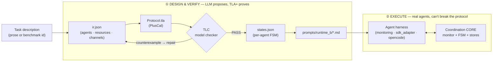

- **Half ①** is *open-loop reasoning made safe*: an LLM designs the coordination
  protocol, but a model checker (TLC) exhaustively proves it is free of deadlocks,
  race conditions, and orphaned resources **before any agent runs**.
- **Half ②** is *execution that can't drift*: real LLM agents do the actual work, but
  every coordination move they make is checked against the verified protocol at
  runtime. An illegal move is blocked and the agent is handed the legal next actions.

The contract between the halves is the **artifact set** (`ir.json`, `states.json`,
`prompts/runtime_b/`). Anything that consumes these artifacts gets the same guarantees.

> **What TLC checks vs. what it doesn't.** TLC verifies *coordination safety*
> (can two agents hold the same lock? can the system deadlock? does everyone
> terminate? are all locks released and channels drained?). It does **not** check
> business-logic correctness — that is the agents' job at runtime, on the data plane.

---

## 2. The artifact pipeline

Everything downstream is a deterministic function of `ir.json`. This is the spine of
the whole system:

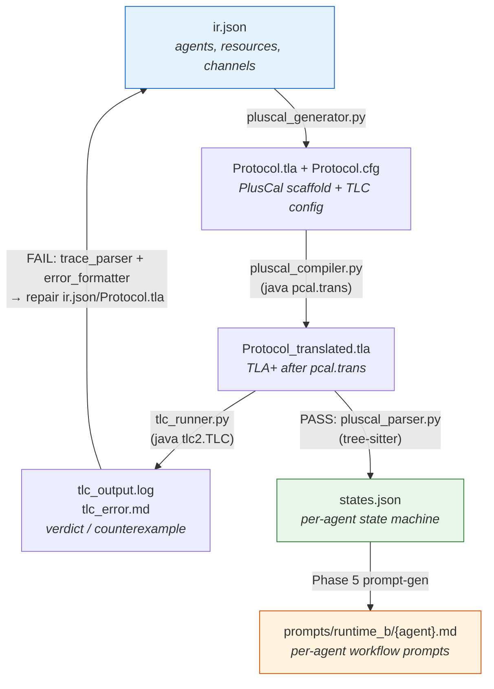

| Stage | Module | In → Out |
|---|---|---|
| Validate | `pipeline/pipeline/validator.py` (`schema.json`) | `ir.json` → schema + semantic OK |
| Scaffold | `pipeline/pipeline/pluscal_generator.py` | `ir.json` → `Protocol.tla` + `Protocol.cfg` |
| Translate | `pipeline/pipeline/pluscal_compiler.py` | `Protocol.tla` → `Protocol_translated.tla` (via `pcal.trans`) |
| Model-check | `pipeline/pipeline/tlc_runner.py` | `Protocol_translated.tla` + `.cfg` → `tlc_output.log` + verdict |
| Explain (on fail) | `trace_parser.py` + `error_formatter.py` | TLC counterexample → human/LLM-readable repair prompt |
| Extract | `pipeline/pipeline/pluscal_parser.py` | `Protocol_translated.tla` + `ir.json` → `states.json` |
| Prompt-gen | Phase 5 (agentic or `/tla-prompt-gen` skill) | `states.json` + `ir.json` → `prompts/runtime_b/*.md` |

The inner pipeline is **pure and deterministic** — no LLM, no randomness. Re-running it
on the same `ir.json` always yields byte-identical artifacts.

---

## 3. Part I — Design & Verification

### 3.1 Two stacked layers

The `tracefix/pipeline/` package is two layers glued together:

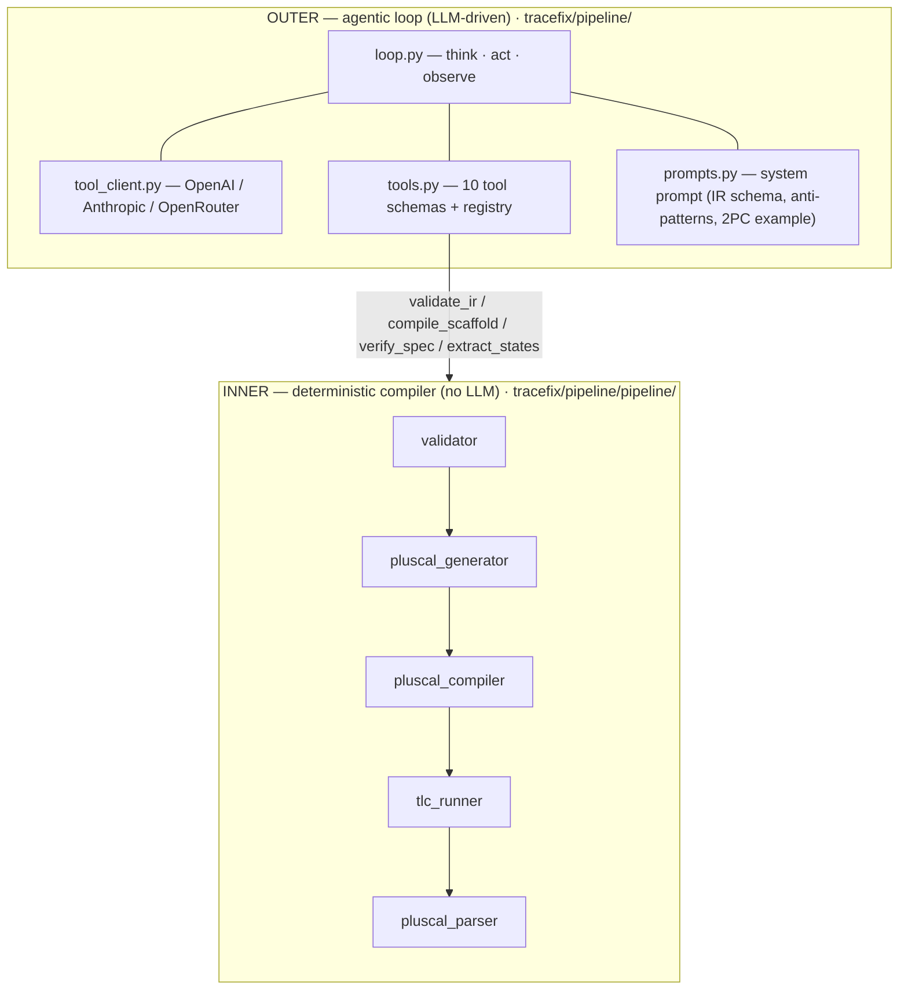

- The **outer layer** is the autonomous agent that *writes* the protocol. It calls the
  inner pipeline through tools, reads the results, and iterates.
- The **inner layer** is the *compiler + verifier*. It has no opinions — it just
  transforms and checks.

The same inner pipeline is also reachable directly through the [CLI](#35-the-human-facing-cli)
(no LLM), so you can drive verification by hand.

### 3.2 The outer agentic loop

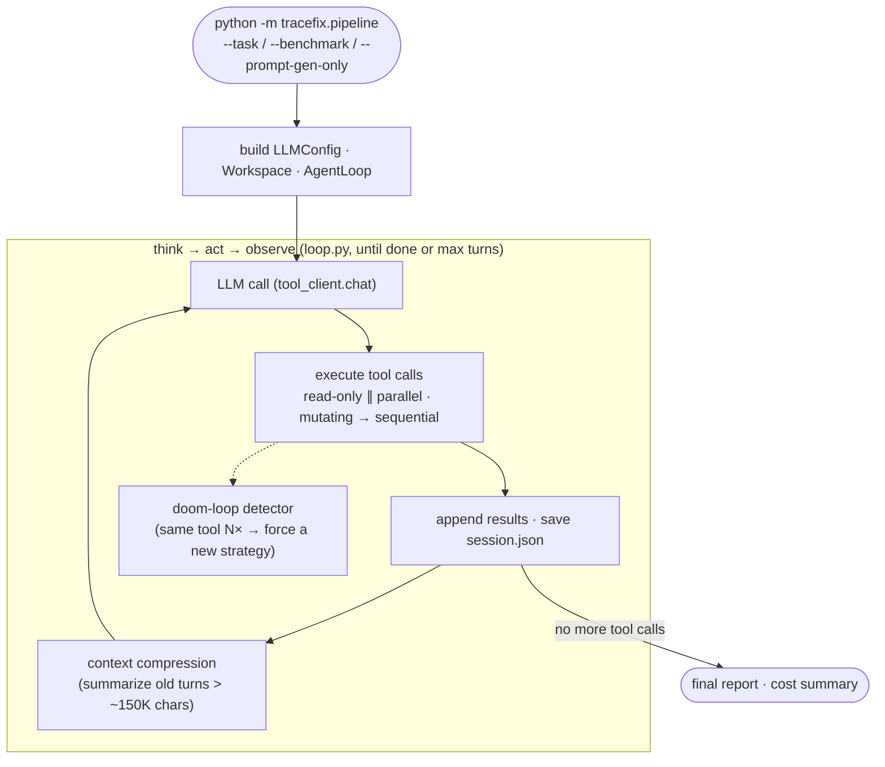

**The 10 tools** (`tools.py`) are the agent's entire action space:

| Tool | What it does |
|---|---|
| `think` | scratchpad reasoning (no side effect) |
| `read_file` / `write_file` / `edit_file` / `list_files` | workspace file I/O |
| `load_benchmark` | pull a benchmark task's `description.md` + `tools.json` + `metadata.json` |
| `validate_ir` | run the schema + semantic validator |
| `compile_scaffold` | `ir.json` → `Protocol.tla` + `Protocol.cfg` |
| `verify_spec` | translate PlusCal + run TLC; archive failed attempts to `history/attempt_N/` |
| `extract_states` | verified TLA+ → `states.json` |

The recommended workflow encoded in the system prompt (`prompts.py`):

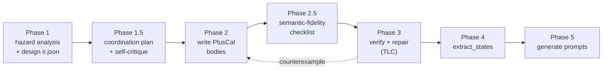

`tool_client.py` makes the loop **provider-agnostic** — the same canonical message and
tool-call format is translated to OpenAI (Chat Completions or Responses API),
Anthropic, or OpenRouter, including reasoning effort / thinking budget and prompt
caching.

### 3.3 The inner deterministic pipeline

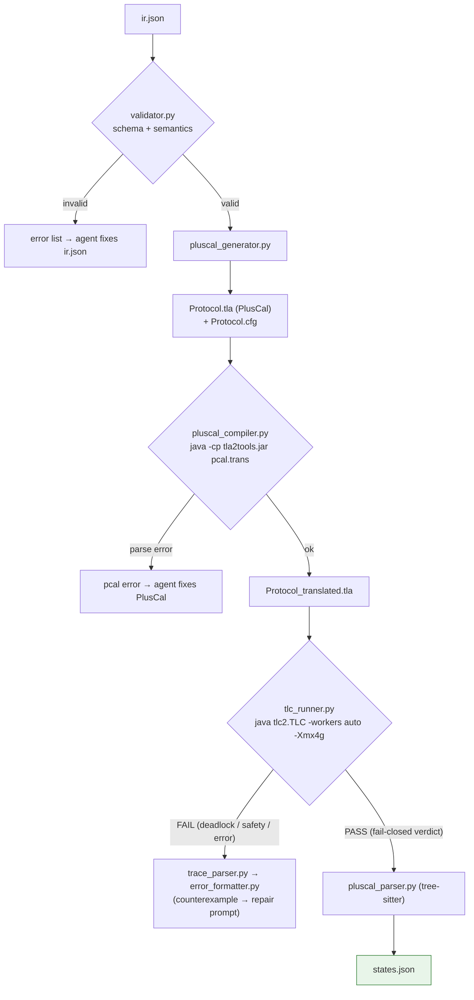

State-space optimizations baked into the generator so TLC stays tractable:

- **One channel per directed (from, to) pair** — `labels` distinguish message types;
  the validator *rejects* duplicate edges.
- **`ChannelBound` CONSTRAINT** — caps channel length so unbounded FIFOs don't explode
  the state space.
- **Per-agent `Next` disjunction** instead of a `\E agent \in Agents` quantifier —
  skips guard evaluation for actions that can't fire for a given agent.
- **String messages**, not TLA+ records — simpler, smaller states.
- **Safety-only checking** — no fairness, no liveness temporal operators; deadlock is
  detected natively by TLC. Because liveness isn't checked, loops need not be bounded.
- **Fail-closed verdict** — `tlc_runner.py` declares success *only* on an explicit
  "Model checking completed" + "No error" token pair. Anything ambiguous is a failure,
  so an unverified spec can never be shipped.

Properties verified on every spec: **deadlock freedom · mutual exclusion · termination ·
no orphan locks · channel drainage · type invariant.**

### 3.4 The repair loop

When TLC fails, the counterexample is turned into a targeted repair prompt and fed
back to the agent. A circuit breaker prevents thrashing:

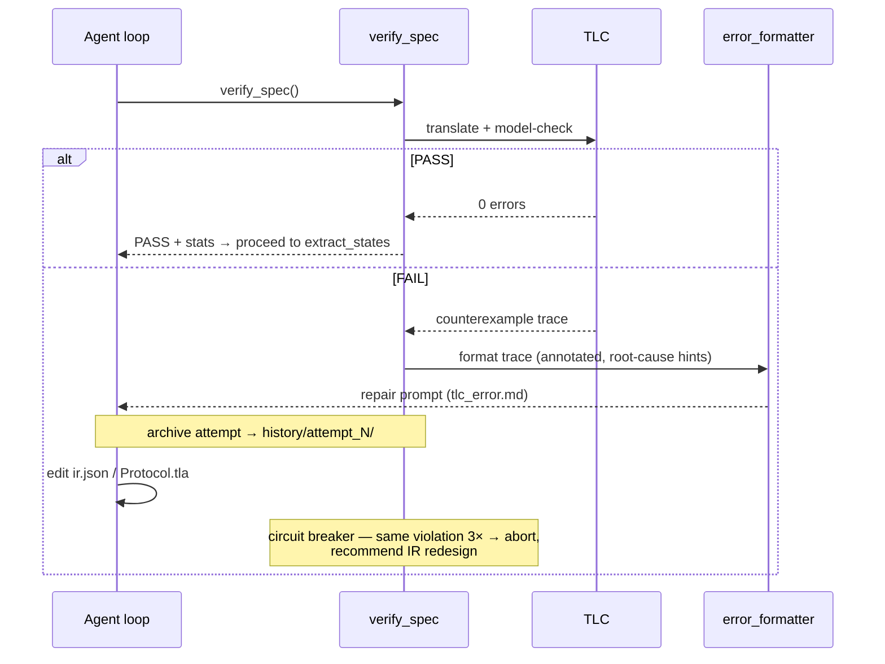

### 3.5 The human-facing CLI

The exact same inner pipeline is exposed *without any LLM* via the `tla-verify-pluscal`
entry point (`tracefix/cli/cli.py`), for scripting, CI, and the Claude Code skills:

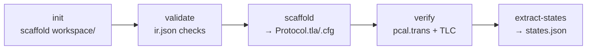

| Command | Inner call | Output |
|---|---|---|
| `init <name>` | — | `workspace/<name>_<timestamp>/` (a *fresh* dir each init) with `spec/ prompts/ output/` + `description.md` |
| `validate ir.json` | `validate_ir` | `VALID` / `INVALID` + errors |
| `scaffold ir.json -o ws/` | `generate_pluscal_scaffold` | `Protocol.tla` + `Protocol.cfg` |
| `verify ws/` | `translate_pluscal` + `run_tlc` | `Protocol_translated.tla`, `tlc_output.log`, `tlc_error.md` |
| `extract-states ws/` | `parse_pluscal` (tree-sitter) | `states.json` (+ `tools.json` if the PlusCal carries `[tool:]` tags) |
| `guide [topic]` | — | prints the **single-source design knowledge** (workflow · PlusCal patterns · prompt-gen) — the same files the skill and the TUI `designer` consume |

Java and the TLA+ toolchain jar resolve through a fallback chain:
`--java-path`/`--jar-path` flag → `TLA_VERIFY_JAVA`/`TLA_VERIFY_JAR` env → hard-coded
macOS Homebrew default. Failed `verify` attempts are archived to
`workspace/history/attempt_N/` (suppress with `--no-history`).

> **Design entry points & single-source knowledge.** Driving this design+verify workflow
> *interactively* has a first-choice front door: the **TraceFix TUI** (`tracefix-tui`, an
> opencode fork) whose `designer` agent runs `tla-verify-pluscal guide` and walks the user
> through it with question prompts + a plan-approval gate. The second choice is the
> `/tla-verify-pluscal` **skill** for users on their own agent harness (Claude Code, etc.).
> `tracefix design` (headless, via `opencode_adapter/design.py`) is the same workflow run
> non-interactively — kept for automation/CI/benchmarking, not promoted as a user path. All
> three read the **one** design knowledge source (the skill files), so they never drift: the
> TUI/headless pull it through `guide`, the skill reads it directly.

---

## 4. Part II — Prompt generation (Phase 5)

Phase 5 turns the verified state machine into one self-contained workflow prompt per
agent. **`states.json` is the ground truth** — every coordination call in a prompt must
map to a transition in the FSM.

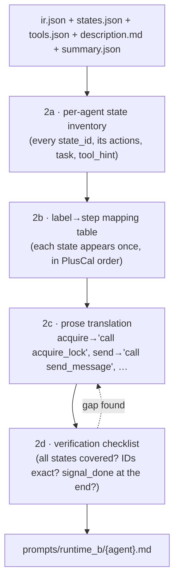

A generated prompt has a fixed anatomy:

```
# {agent_id} — Agent Prompt
## 1. Context            role + position in the protocol topology
## 2. Coordination       shared resources (locks/counters) + channels you send/receive
## 3. Step-by-step       numbered workflow: Coordinate lines (control) + Work lines (business)
## Critical Rules        rule #1 is always "adhere to the protocol; retry on timeout"
```

Key design points:

- **No `## Tools` section.** The runtime injects both the domain tool schemas *and* the
  coordination tool schemas separately. The prompt only references them by name.
- **Business `task` lines** come from `\* domain:` / `(* ... *)` comments in the PlusCal,
  lifted into `states.json` `task` fields. They describe *what work* happens in a state
  but never affect coordination order.
- **Control vs. business are visually split** in each step: a `Coordinate:` line (lock /
  channel op) and a `Work:` line (domain work).
- Runtime A (a coordination-free prompt variant) **was retired** — the system generates
  `runtime_b/` only.

---

## 5. Part III — Runtime execution

### 5.1 The three-plane model

This is the central idea of the runtime. Agent activity is split into three planes that
**cannot interfere** with each other:

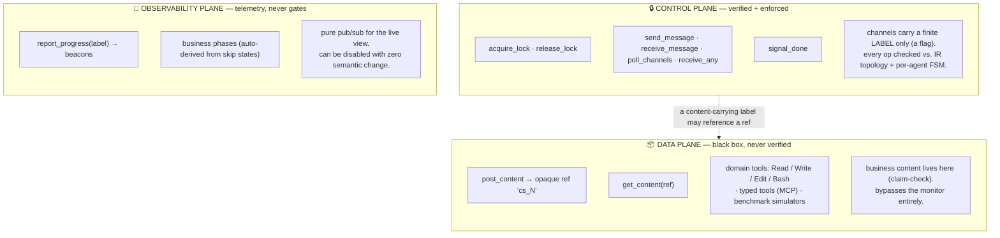

The load-bearing rule is **SOLE-MEDIATION**:

> Coordination state `S = (locks, counters, channel-FIFOs, FSM positions, done-set)` can
> *only* be mutated by a monitored, content-blind, FSM-gated control-plane op. **Business
> content can never *cause* a coordination transition.**

This is why content is deliberately pushed to the data plane (the *claim-check*
pattern): a message on a channel carries an opaque ref like `cs_7`, not the content
itself. The verified protocol reasons about *labels* (`accept`, `revise`, `submit`); the
actual revision text rides the data plane where TLC never has to see it. The control
plane and the verified spec stay in lock-step.

### 5.2 The coordination core

Every harness reuses this core **unchanged** (`tracefix/runtime/store.py` +
`tracefix/runtime/monitoring/`):

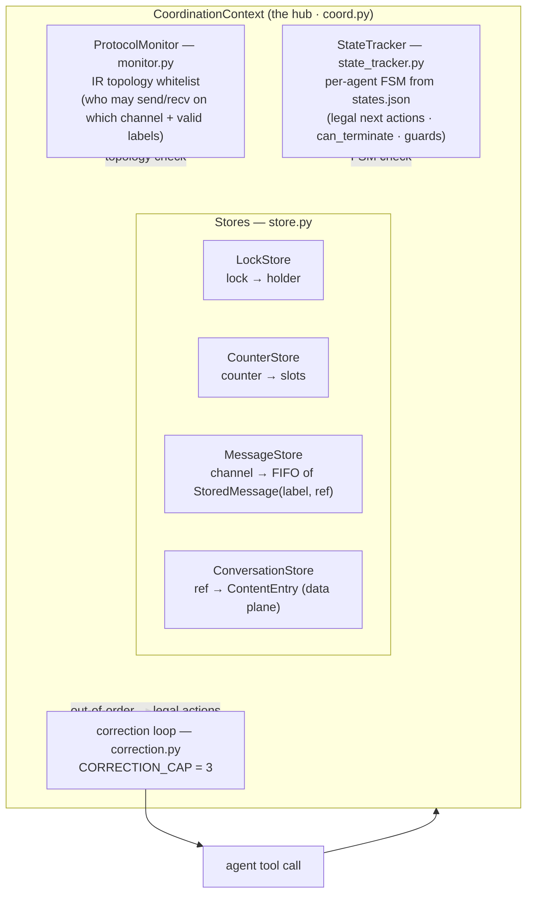

- **`ProtocolMonitor`** answers *static* questions from `ir.json`: may this agent send on
  this channel? is this label valid here? does this lock exist?
- **`StateTracker`** answers *dynamic* questions from `states.json`: given where this
  agent is in its FSM, is this op a legal next step? can it terminate now?
- **`correction.py`** turns a rejection into a teachable moment — it hands the agent the
  legal next actions. After `CORRECTION_CAP` (3) unrecovered tries at the same state, the
  run **fails honestly** rather than looping forever.

### 5.3 The validation pipeline (per operation)

Every control-plane op runs the same gauntlet, in this order:

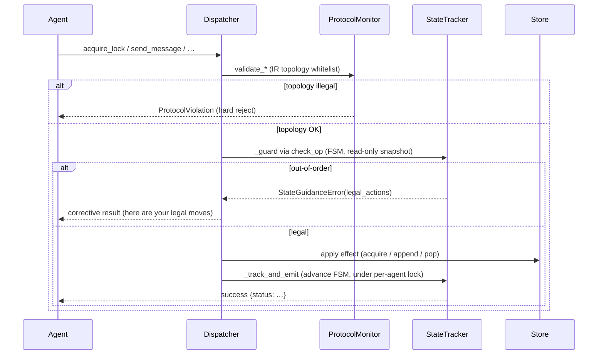

The three hardening fixes that close real holes (each backed by a regression test):

| Fix | Hole | Guard |
|---|---|---|
| **H1** | `send_message` could smuggle a free-form `body`, bypassing the data/control split | `body` removed from the base schema; channels are flag-only. A `ref` is allowed *only* on declared `content_labels` (default-closed), and those labels *require* a ref. |
| **H2** | `release_lock` didn't check ownership — a non-holder could free someone else's lock, breaking mutual exclusion | owner check *before* the effect: only the current holder may release. |
| **H3** | `signal_done` could fire while protocol obligations remained, stranding peers | `can_terminate()` walks the FSM (skip chains + guards) to confirm a terminal state is reachable before allowing done. |

### 5.4 Three harnesses over one core

The agent *loop* is pluggable; the verified *core* is not. Each harness translates its
native tool calls into the same `CoordToolDispatcher` → `CoordinationContext` path:

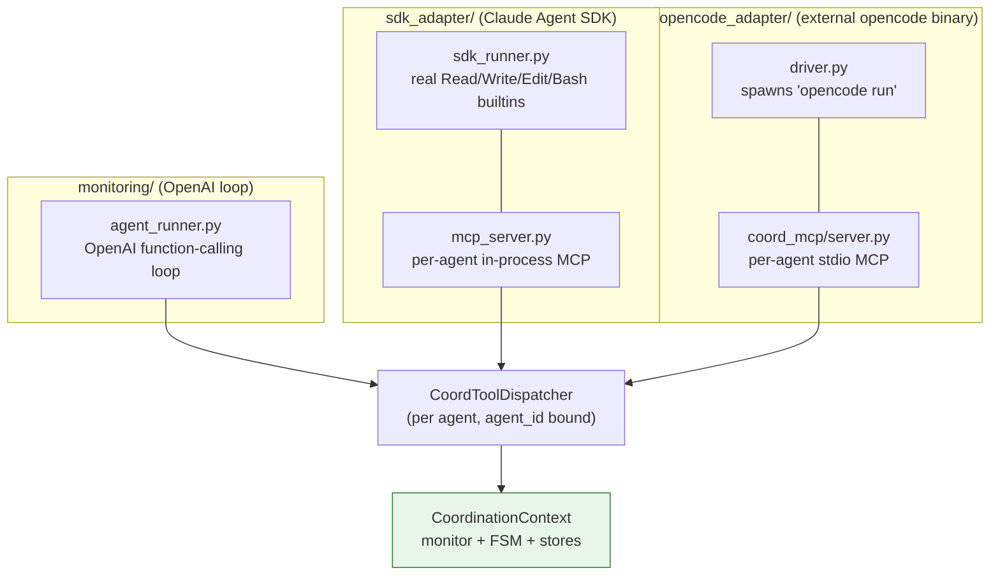

| Harness | Agent loop | Domain work | Coordination transport |
|---|---|---|---|
| **`monitoring/`** | built-in OpenAI loop | benchmark simulators (`SimContext`) | direct in-process calls |
| **`sdk_adapter/`** | Claude Agent SDK `query()` | **real** `Read`/`Write`/`Edit`/`Bash` (or `tools.json`) | per-agent **in-process** MCP server |
| **`opencode_adapter/`** | external `opencode` binary (no source mods) | opencode's builtins | per-agent **stdio** MCP (`coord_mcp`) → `CoordClient` → central service |

What stays identical across all three: the coordination tool schemas
(`COORD_TOOL_SCHEMAS`), the monitor, the FSM tracker, the correction loop, the
three-plane split, and the per-agent prompts. Swapping the harness changes *who runs the
agent*, never *what the protocol allows*.

> **`opencode_adapter/` is the default harness** (what `tracefix run` and the TUI use).
> **`sdk_adapter/`** also does real work with real file/shell tools. **`monitoring/` is the
> benchmark/eval harness** (deterministic simulators, failure injection, cost tracking).

### 5.5 The distributed boundary

`coordination/` puts the verified core behind a network seam so agents can be separate
processes. The trick: the verified logic runs **verbatim** inside one authoritative
service; blocking stays server-side.

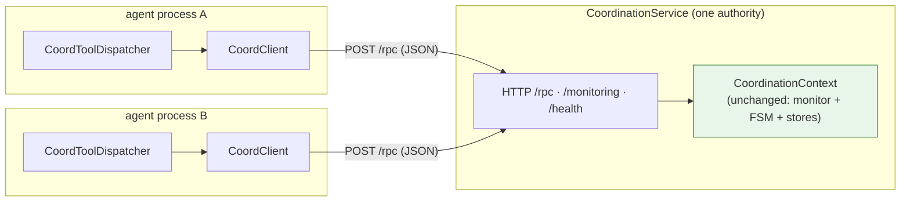

- **`CoordBackend`** (`backend.py`) is the seam: both the in-process
  `CoordinationContext` and the remote `CoordClient` satisfy the same interface, so the
  dispatcher doesn't know or care which one it's holding.
- **Blocking is transparent**: a remote `receive` / `acquire_lock` simply doesn't return
  its HTTP response until the server-side `asyncio.Condition` fires. No cross-node
  signaling needed.
- This is the **IPC backbone the opencode harness uses on every run** (its subprocesses
  reach the in-process service over loopback). `sdk_adapter --coord-url` switches to it
  too.
- **Full parity over the wire.** The control plane, the data plane
  (`post_content`/`get_content`, served from the one authoritative `ConversationStore` so a
  `ref` posted on one node resolves on another), and the `signal_done` FSM gate all route
  through the service — the distributed path enforces exactly what in-process does. Each
  agent also carries a per-agent capability **token** (`X-Tracefix-Token`), so a process
  that can reach the loopback port (e.g. an opencode agent with Bash) cannot forge
  coordination ops as a *different* agent.
- **Phase-1 scope (loopback only).** The service binds `127.0.0.1`, so all agents run on one
  machine; cross-machine deployment (shared artifact store, TLS, reconnect) is future work.

### 5.6 The mixed-harness proof

`mixed_run.py` is the falsifiable claim that the core really is harness-agnostic: it runs
*some* agents on opencode and *others* on the Claude SDK, against **one** service and
**one** output directory. Channels that cross the harness boundary prove the FSM treats
every agent identically.

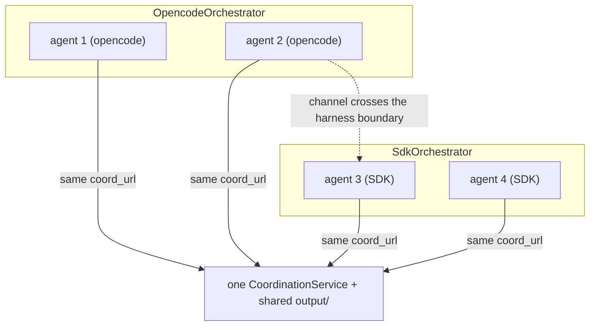

### 5.7 Typed domain tools — real APIs beside the builtins

By default an agent's domain work uses the harness builtins (`Read`/`Write`/`Edit`/`Bash`)
or a benchmark simulator. But a design can give a *specific* agent a **typed domain tool**
— a named function with a real implementation — by tagging the PlusCal step:

```
\* domain: charge the customer [tool: charge_payment(amount: number) -> {ok, txn_id}; impl: external]
```

`extract-states` lifts each tag into a workspace `tools.json` (JSON-Schema + per-tool
`agent_ids` = the process the tag lives in) plus an implementation stub, and the runtime
exposes each typed tool **only to its owning agent** over MCP:

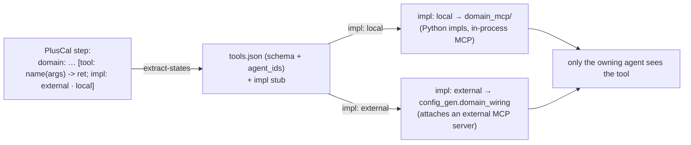

So one run mixes **builtin collaboration** (agents editing shared files under the verified
locks) with **real typed API calls** (an agent invoking an external service) — and the
coordination protocol is identical either way: typed tools live on the **data plane** and
are never seen by the monitor. A hand-written workspace `tools.json` works the same way;
benchmark tasks ship one. Plain `\* domain:` work (no tag) just runs on the builtins.

---

## 6. Part IV — Benchmarks

`benchmark/` ships two tiers. The **fully-specified tier** is **48 coordination tasks =
16 scenarios × 3 difficulties (E/M/H)** — descriptions enumerate the agents, resources, and
communication, so they measure *extraction + compilation + verification + repair* against
canonical IDs.

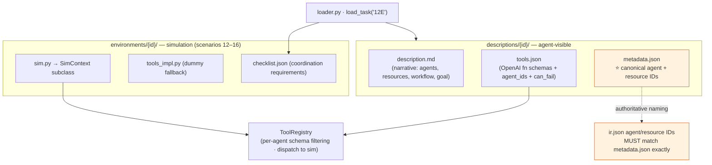

- **`metadata.json` is the single source of truth for naming.** Agent and resource IDs in
  `ir.json` must match it *exactly* (case-sensitive) — the registry filters tools by
  agent ID and the simulator tracks resources by ID, so a mismatch silently breaks both.
- **`ToolRegistry`** filters the tool schema per agent (`agent_ids`) and strips the extra
  `agent_ids` / `can_fail` fields before handing schemas to the LLM.
- **`SimContext`** (base class) provides resource management, per-agent seeded RNG,
  violation logging, and **failure injection**. Scenarios 12–16 have full simulators;
  two mutually-exclusive injection modes:
  - `--difficulty 0-3` → probabilistic failure `{0%, 30%, 60%, 90%}` on decision tools;
  - `--scenario N` → deterministic: fail the first N calls per tool per agent.
- Scenarios **1–11 are coordination-only** (descriptions + checklist, no simulator).

The **narrative tier** (`benchmark/underspecified/{id}/` — `description.md` + `meta.json`)
measures the *design* capability instead: 6 scenarios rewritten as unscaffolded prose, with
**no** agent/resource enumeration, so the designer must derive the topology itself. It is
scored property-based by `python -m benchmark.underspec_eval --task <id>`: TLC PASS
(`spec/summary.json`) + structural assumptions recorded in `plan.md` under `## Assumptions`
+ every requirement on the parent scenario's `checklist.json` satisfied, judged by an LLM
that is **name-agnostic** (the designer picks its own IDs). `meta.json` links each task to
its fully-specified parent; `benchmark/tests/test_underspecified.py` guards that no
scaffolding or canonical IDs leak back into the prose.

---

## 7. Part V — The observability plane

A pure-telemetry layer that renders runs live in the browser and **never** gates
coordination — if it crashes, the protocol is unaffected.

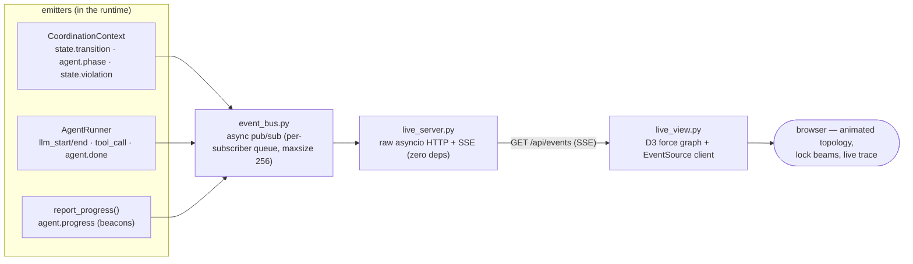

- **Business phases** are *auto-derived*: when an agent sits in a no-op skip state (doing
  domain work), the `StateTracker` records it as the agent's current phase. Phases are
  never in `states.json` and never verified — they're a UI convenience.
- **Beacons** (`report_progress`) deliberately bypass `_track_and_emit` — they append to a
  `beacons` list and emit an event, touching neither monitor, FSM, nor stores.
- Toggled per-harness with `--live`. No `--live` → `event_bus = None` and every code path
  behaves identically, minus the SSE emissions. There's also a **static** post-run HTML
  renderer (`visualize.py`) that bakes the full trace into a standalone file.

---

## 8. Appendix A — Artifact reference

| Artifact | Produced by | Consumed by | Role |
|---|---|---|---|
| `description.md` / `tools.json` | task author / benchmark | agentic loop, prompt-gen, runtime | the task + domain tools |
| `ir.json` | agentic loop / `init` | everything downstream | coordination topology (agents, resources, channels) |
| `Protocol.tla` + `Protocol.cfg` | `pluscal_generator` | `pcal.trans`, TLC | PlusCal spec + TLC config |
| `Protocol_translated.tla` | `pcal.trans` | TLC, `pluscal_parser` | translated TLA+ |
| `tlc_output.log` / `tlc_error.md` | `tlc_runner` / `error_formatter` | agent (repair), humans | verdict / counterexample |
| `states.json` | `pluscal_parser` | prompt-gen, `StateTracker` | **per-agent FSM — the runtime ground truth** |
| `summary.json` | verify loop | prompt-gen | repair tracking (boosts Critical Rules) |
| `prompts/runtime_b/{agent}.md` | Phase 5 | all harnesses | per-agent workflow prompt |
| `output/shared/` | agents at runtime | other agents | the data plane: handoff/coordinated files (every agent's cwd) |
| `output/<agent>/` | one agent at runtime | itself | that agent's private scratch (its own tests, temp, intermediate work) |
| `run_result.json` / `run_trace.html` | `result_saver` / `visualize` | analysis, dashboards | run snapshot + visualization |

---

## 9. Appendix B — Key invariants

1. **Sole mediation** — coordination state changes *only* through a monitored,
   FSM-gated, content-blind control-plane op.
2. **Content can never cause a transition** — `post_content`/`get_content` bypass the
   monitor entirely; channels carry labels (+ opaque refs), never business content.
3. **Fail-closed verification** — TLC must explicitly say "no error"; ambiguity =
   failure. Unverified specs cannot ship.
4. **Fail-honest runtime** — after `CORRECTION_CAP` (3) unrecovered out-of-order tries at
   one state, the agent fails rather than faking progress or looping.
5. **Harness-agnostic core** — `monitoring`, `sdk_adapter`, and `opencode_adapter` reuse
   `CoordinationContext` / `ProtocolMonitor` / `StateTracker` **unchanged**; `mixed_run`
   proves it.
6. **Observability never gates** — the event bus / live view can fail or be disabled with
   zero effect on correctness.
7. **Naming is authoritative** — `benchmark/.../metadata.json` IDs must match `ir.json`
   exactly.

---

## 10. Appendix C — Directory map

```
tracefix/
├── pipeline/                 # ① DESIGN & VERIFY
│   ├── cli.py loop.py tool_client.py tools.py prompts.py   # outer agentic loop
│   └── pipeline/             # inner deterministic compiler
│       ├── validator.py schema.json
│       ├── pluscal_generator.py pluscal_compiler.py tlc_runner.py
│       ├── trace_parser.py error_formatter.py
│       └── pluscal_parser.py            # tree-sitter → states.json
├── cli/                      # tla-verify-pluscal (no-LLM CLI over the inner pipeline)
└── runtime/                  # ② EXECUTE
    ├── store.py              # LockStore · CounterStore · MessageStore · ConversationStore
    ├── workspace_layout.py   # spec/ prompts/ output/ resolution
    ├── monitoring/           # OpenAI-loop harness + the shared CORE
    │   ├── coord.py monitor.py state_tracker.py correction.py   # ← reused by all harnesses
    │   ├── agent_runner.py orchestrator.py cost.py result_saver.py
    │   └── event_bus.py live_server.py live_view.py visualize.py  # observability
    ├── sdk_adapter/          # Claude Agent SDK harness (dispatch · mcp_server · sdk_runner)
    ├── opencode_adapter/     # opencode harness (config_gen · driver · orchestrator)
    ├── coord_mcp/            # shared stdio MCP server (coordination tools)
    ├── domain_mcp/           # typed domain tools — impl: local Python impls over MCP
    ├── coordination/         # distributed seam (backend · service · client)
    └── mixed_run.py          # cross-harness proof

benchmark/                    # fully-specified tier (48 tasks = 16 scenarios × E/M/H)
├── loader.py
├── descriptions/{id}/        # description.md · tools.json · metadata.json
├── environments/{id}/        # sim.py · tools_impl.py · checklist.json
├── underspecified/{id}/      # narrative tier — description.md · meta.json (prose, no scaffolding)
├── underspec_eval.py         # property-based scorer for the narrative tier
└── tools/                    # ToolRegistry · SimContext base
```

---

*Generated for the TraceFix open-source release. For build/run commands see the root
[`README.md`](../README.md) and [`CLAUDE.md`](../CLAUDE.md). The first-choice way to design
a protocol interactively is the **TraceFix TUI** (`tracefix-tui`); for users on their own
agent harness the human-in-the-loop workflow lives in the `/tla-verify-pluscal` and
`/tla-prompt-gen` skills (the single source the TUI also consumes via `tla-verify-pluscal
guide`).*
