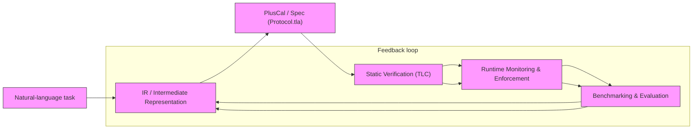

## Direction 3  Benchmarks & Evaluation

Evaluating verification of multi-agent systems is hard because failures are both rare and interleaving-dependent: subtle ordering variations produce counterexamples that are sparse in the execution space, so standard testing under-samples hazardous schedules. A good coordination benchmark must provide: (1) ground-truth violations (machine-checkable traces or states.json counterexamples); (2) deterministic failure injection (fixed interleavings, deterministic crash scenarios) plus probabilistic fuzzing; (3) scalable difficulty levels and scenario parametrization to stress partial-order combinatorics. Measure: violation-detection rate, correction-recovery rate (time-to-correct and success), false-positive rate, runtime/communication overhead, and semantic fidelity (does corrected behavior meet the domain checklist). For reproducibility require seeded RNGs, archival traces, and the ability to replay exact interleavings. Open problem: constructing realistic task distributions and coverage metrics that quantify emergent-behavior exposure across plausible long-running workloads.

## Direction 2  Runtime Monitoring & Enforcement

Static verification is necessary but not sufficient: LLM-driven agents can diverge at runtime due to stochastic outputs, prompt injection, distributional shift, environment nondeterminism, or implementation bugs. Runtime monitors must validate every coordination action against the verified per-agent state machine (states.json) rather than trusting offline proofs alone. Practically, monitors check control-plane labels (acquire_lock, send_message, receive_message, release_lock, signal_done) while the data-plane (shared files/resources) remains protected under locks  the control-plane / data-plane split keeps coordination signals auditable and prevents leaking content on channels.

Enforcement is deliberate: block an illegal action, return the legal next actions as correction guidance, attempt a bounded correction loop (a small CORRECTION_CAP of retries), and if recovery fails perform honest failure (abort, surface the counterexample, and archive the trace). Open problem: scaling trustworthy monitoring to distributed, partially observed deployments and detecting emergent behaviors that lie outside the verified state machine's expressivity.

## Direction 1  Formal Methods & Static Verification

Coordination bugs such as deadlocks, races, and lost-updates are hard to catch with testing because they depend on rare interleavings, nondeterministic environment and LLM stochasticity, and exponential schedule space; fuzzing under-samples hazardous schedules.

Model checking offers exhaustive exploration of the coordination state space: the TraceFix pipeline compiles an IR into PlusCal (a high-level algorithm) which pcal.trans translates into TLA+ and TLC exhaustively model-checks safety properties. PlusCal/TLA+ make it practical to express per-agent state machines and channel semantics used by the runtimes.

The primary challenge is state-space explosion. Mitigations include symmetry reduction (identify interchangeable agents/roles to quotient the state graph) and bounding channels or message counts (ChannelBound constraints) to obtain finite-state models while preserving relevant behaviors. Bounded exhaustive checks plus parameterized reasoning can catch many bugs.

Open problem: automatically inferring precise formal specifications from natural-language task descriptions (or otherwise aligning verified protocols with the LLM9s actual runtime behavior) so that verification guarantees meaningfully constrain stochastic agent outputs.

## Figure  Taxonomy of LLM MAS Verification

